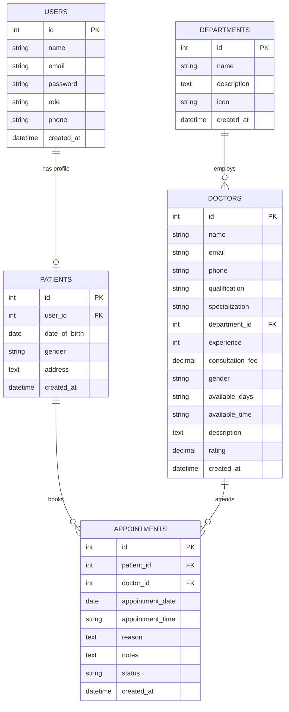
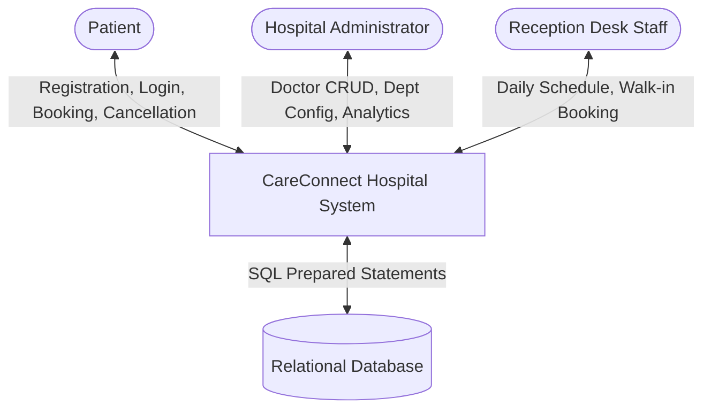
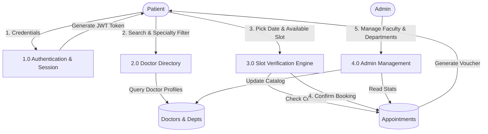

# CareConnect Hospital Appointment System - Complete Project Documentation
**Course:** TY Computer Science (Bachelor of Computer Science / BCA / BE Computer)  
**Project Title:** CareConnect Hospital Appointment System  
**Developed by:** Student (TYCS)  
**Academic Year:** 2025–2026  

---

## 1. Introduction
In conventional healthcare institutions, appointment scheduling is predominantly conducted through physical counter queues or uncoordinated telephone interactions. This creates prolonged waiting times, administrative overload on hospital staff, and accidental double-booking of doctors.

**CareConnect Hospital** is a modern, responsive, web-based appointment management system designed to streamline patient scheduling, automate doctor slot management, and provide role-based administrative dashboards for outpatient departments (OPD).

---

## 2. Problem Statement & Problem Justification

### 2.1 Problem Statement
Patients visiting multispecialty hospitals frequently face excessive queue times, lack of real-time visibility into doctor consultation schedules, and confusion regarding consultation charges. Hospital administrators concurrently lack centralized real-time analytics to monitor appointment loads, manage departmental staffing, and prevent duplicate patient bookings.

### 2.2 Problem Justification
1. **Time Inefficiency:** Physical token distribution requires patients to wait hours merely to secure a 10-minute consultation.
2. **Double Booking:** Manual paper registers cannot prevent two patients from reserving the identical time slot with a physician.
3. **Data Inaccessibility:** Patients lack historical records of their prior consultations and medical summaries.
4. **Administrative Bottlenecks:** Receptionists struggle to triage walk-in patients alongside pre-booked visits.

---

## 3. Scope & Objectives

### 3.1 Project Objectives
- Enable patients to browse qualified physicians across 8 specialized clinical departments.
- Implement live slot allocation preventing conflict bookings and invalid past-date entries.
- Furnish an interactive Patient Portal for consultation tracking, appointment cancellations, and printable appointment slips.
- Deliver an Admin Dashboard with real-time operational metrics, interactive department distribution charts, and full CRUD controls for doctors and departments.
- Equip the Receptionist Counter with daily schedule tracking, quick walk-in patient registration, and instant status updates.

### 3.2 Project Scope
The application encompasses outpatient appointment workflows for multi-department hospitals. It covers patient registration, doctor catalog search, dynamic time slot management, role-based access control (RBAC), and appointment cancellation logic.

---

## 4. Feasibility Analysis

1. **Technical Feasibility:** Developed using Node.js, Express, and standard relational SQL databases (Node 24 built-in SQLite engine with zero third-party database daemon overhead, alongside 100% compatible MySQL DDL/DML scripts). The system runs seamlessly on standard desktop configurations.
2. **Operational Feasibility:** The user interface features high-contrast healthcare palettes, clear iconography (FontAwesome 6), intuitive form fields, and 1-click credential switchers for smooth viva examination demonstrations.
3. **Economic Feasibility:** Built entirely on open-source web technologies requiring zero paid software licenses or proprietary runtime environments.

---

## 5. Functional & Non-Functional Requirements

### 5.1 Functional Requirements
- **FR-01 (Authentication):** Secure registration, bcrypt password hashing, JWT session verification, and role differentiation (Patient, Admin, Receptionist).
- **FR-02 (Doctor Discovery):** Multi-criteria filtering by medical department, specialization, gender, and doctor name.
- **FR-03 (Slot Management):** Generation of 12 daily outpatient slots (09:00 AM – 04:30 PM) with real-time status reflection (Available, Booked, Past).
- **FR-04 (Booking Engine):** Duplicate booking prevention (`HTTP 409 Conflict`) and past-date validation (`HTTP 400 Bad Request`).
- **FR-05 (Cancellation & Rescheduling):** Immediate slot liberation upon cancellation and rescheduling validations.
- **FR-06 (Administration):** Modal-driven CRUD controls for medical staff, department configurations, and patient directory oversight.
- **FR-07 (Print System):** Print-friendly layout generating official confirmation vouchers complete with hospital letterhead and unique ID numbers.

### 5.2 Non-Functional Requirements
- **NFR-01 (Performance):** Sub-100ms API response latency using prepared relational queries and indexing.
- **NFR-02 (Security):** Role-based route middleware, parameter sanitization, and bcrypt salt hashing.
- **NFR-03 (Usability):** Responsive layout functioning across mobile (375px), tablet (768px), and desktop (1200px+).
- **NFR-04 (Reliability):** ACID transactional consistency across all appointment scheduling operations.

---

## 6. Hardware & Software Requirements

### 6.1 Hardware Requirements
- **Processor:** Intel Core i3 / AMD Ryzen 3 or higher
- **RAM:** 4 GB minimum (8 GB recommended)
- **Disk Space:** 500 MB free hard drive storage
- **Display:** 1366x768 minimum screen resolution

### 6.2 Software Requirements
- **Operating System:** Windows 10/11, macOS, or Linux (Ubuntu 20.04+)
- **Runtime Environment:** Node.js (v18.x – v24.x)
- **Database:** Node.js Native SQLite (`database/careconnect.db`) or MySQL 5.7/8.0 (`database/schema.sql`)
- **Web Browser:** Google Chrome, Microsoft Edge, or Mozilla Firefox

---

## 7. System Architecture & Diagrams

### 7.1 Three-Tier System Architecture
```
+-------------------------------------------------------------+
|                     PRESENTATION TIER                       |
|   HTML5 + Vanilla CSS (Healthcare Theme) + JavaScript ES6   |
|   (index.html, doctors.html, patient/admin/receptionist)    |
+-------------------------------------------------------------+
                              |
                     REST APIs (JSON / JWT)
                              |
+-------------------------------------------------------------+
|                     APPLICATION TIER                        |
|       Express.js Server + Controllers & Middleware          |
|    (authController, doctorController, appointmentController)|
+-------------------------------------------------------------+
                              |
                     Prepared SQL Queries
                              |
+-------------------------------------------------------------+
|                       DATABASE TIER                         |
|    Relational Database Engine (SQLite / MySQL 8.0)          |
|     Tables: users, patients, doctors, departments, appts    |
+-------------------------------------------------------------+
```

### 7.2 Entity-Relationship (ER) Diagram (Mermaid)



### 7.3 Data Flow Diagram (DFD Level 0 - Context Level)



### 7.4 Data Flow Diagram (DFD Level 1)



### 7.5 Use Case Diagram Description
- **Patient Actor:** Register, Login, Browse Doctors, Filter by Department, Inspect Doctor Bio, Check Live Time Slots, Book Consultation, View Upcoming Visits, Cancel Upcoming Visit, Update Patient Profile, Print Appointment Slip.
- **Admin Actor:** Secure Admin Login, View High-Level KPI Cards, Inspect Department and Status Charts, Create/Edit/Delete Doctor, Create/Edit/Delete Department, Inspect Patient Records, Supervise All Appointments (Confirm/Complete/Cancel).
- **Receptionist Actor:** Staff Login, Review Daily Consultation Schedule, Search Patient Directory, Register Walk-in Patient, Reschedule Appointment, Mark Consultation Completed, Cancel Appointment.

---

## 8. Database Schema & Integrity Constraints

1. **Table `users`:** Stores system credentials. Unique constraint on `email`. Role constrained to `'Patient'`, `'Admin'`, `'Receptionist'`.
2. **Table `patients`:** One-to-one relationship with `users` via foreign key `user_id` with `ON DELETE CASCADE`. Stores DOB, gender, address.
3. **Table `departments`:** Stores clinical departments. Unique constraint on `name`.
4. **Table `doctors`:** Foreign key `department_id` references `departments(id)`. Enforces fees, experience, timings, and credentials.
5. **Table `appointments`:** Connects `patient_id` and `doctor_id`. Enforces non-duplicate scheduling through constraint verification: `(doctor_id, appointment_date, appointment_time, status != 'Cancelled')`.

---

## 9. Viva Voce Examination Questions & Answers (Student Preparation)

### Q1: What is the architecture of this project?
**Answer:** The project follows a clean **3-Tier Model-View-Controller (MVC) RESTful architecture**:
- **Presentation Layer (Frontend):** Modern HTML5, Vanilla CSS3, and JavaScript ES6 communicating via asynchronous fetch requests.
- **Application Layer (Backend):** Node.js and Express REST API controllers with JWT authentication middleware.
- **Data Layer (Database):** Relational SQL storage using Node.js's built-in SQLite engine for instant execution, alongside full MySQL DDL/DML scripts for enterprise deployment.

### Q2: How is double-booking of doctors prevented?
**Answer:** Double-booking is eliminated at both the frontend and backend levels:
1. When a patient chooses a date on `book-appointment.html`, the frontend queries `GET /api/doctors/:id/slots?date=YYYY-MM-DD`. The server looks up existing active bookings (`status != 'Cancelled'`) and disables already-booked slots.
2. At the database layer, when `POST /api/appointments` is called, the controller executes a collision check query. If another active booking exists for the same doctor at that date and time, the server returns an `HTTP 409 Conflict` status with a descriptive error message.

### Q3: How is password security managed?
**Answer:** Passwords are never stored in plain text. When a user registers, the password is encrypted using **bcrypt** with 10 salt rounds (`bcryptjs.hashSync`). During login, `bcrypt.compareSync` verifies the password hash against the stored hash.

### Q4: How does role-based authorization work?
**Answer:** Upon successful login, the server issues a digitally signed **JSON Web Token (JWT)** containing the user's ID, role, and patient ID. The backend `requireRole(['Admin'])` middleware checks the token on protected routes. If an unprivileged user attempts an admin operation, the server returns an `HTTP 403 Forbidden` response.

### Q5: How can this system run on MySQL?
**Answer:** In the `database/` folder, two complete scripts are provided:
- `schema.sql`: Contains the complete MySQL DDL script with table definitions, foreign keys, and indexes.
- `sample-data.sql`: Contains sample Indian patient, doctor, and department records.
These scripts can be imported directly into MySQL Workbench or phpMyAdmin using `source schema.sql;`.

---

## 10. Conclusion & Future Scope

### 10.1 Conclusion
CareConnect Hospital demonstrates that an intuitive, modern, full-stack appointment system can be built with clean architecture, zero complicated dependencies, and robust data integrity suitable for both real-world outpatient departments and high-scoring university computer science evaluations.

### 10.2 Future Scope
- Automated SMS / WhatsApp appointment reminders via Twilio or Gupshup API.
- Integration of a Telemedicine Video Consultation room using WebRTC.
- Integration of UPI and card payment gateways (e.g. Razorpay) for advance consultation fee collection.
- Electronic Health Record (EHR) prescription upload and diagnostic laboratory report downloads.
